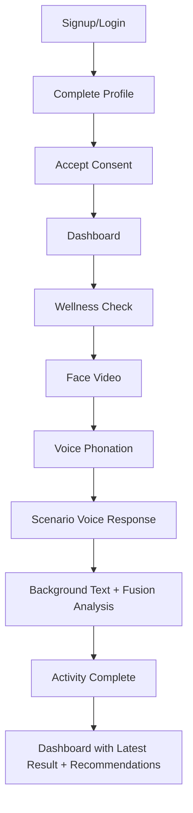

# MindSpace

<p align="center">
   <strong>AI-assisted wellness screening and support platform built with Django</strong><br/>
   Face + voice + text assessment pipelines, personalized activity recommendations, counselor support, and chatbot integration.
</p>

<p align="center">
   
   
   
   
</p>

> Important: MindSpace provides wellness risk predictions and support tools. It is not a medical diagnosis system and does not replace professional mental-health care.

## Why MindSpace

MindSpace provides a guided wellness check journey:

- Structured onboarding: signup, profile, consent
- Three modality capture flow: face video, voice phonation, scenario voice response
- Background AI processing for each modality and final fusion prediction
- Dashboard with latest risk summary, streak, and daily progress
- Personalized activity recommendations mapped from latest prediction label
- Support surfaces: counselor page and chatbot experience

## Product Flow



## Architecture Snapshot

```text
config/                  # Django project config (settings, urls, ASGI/WSGI)
mindspace/models.py      # Core data models
mindspace/views/         # Feature-organized view modules
mindspace/services/      # Business logic and integration layers
mindspace/tasks/         # Background assessment tasks
templates/               # Django templates (auth, dashboard, activity, chat, etc.)
static/                  # CSS/JS/images
media/                   # Uploaded user media (dev/local)
```

Core service modules:

- `mindspace/services/assessments/api_clients.py`
- `mindspace/services/assessments/media_processing.py`
- `mindspace/services/assessments/fusion_builder.py`
- `mindspace/services/assessments/result_savers.py`
- `mindspace/services/activity/recommendations.py`

## Tech Stack

- Backend: Django 6.x
- Language: Python 3.12+
- Database: PostgreSQL
- Auth: Django auth + django-allauth
- Background tasks: Django-Q / Django-Q2
- Queue broker (recommended): Redis
- Frontend: Django templates, HTML, CSS, JavaScript
- External APIs: face, voice, PCA, text, fusion, Sarvam STT, chatbot

## Quick Start

### 1. Clone repository

```bash
git clone <your-repo-url>
cd MS
```

### 2. Create environment

Conda:

```bash
conda create -n mindspace python=3.12
conda activate mindspace
```

or venv:

```bash
python3 -m venv .venv
source .venv/bin/activate
```

### 3. Install dependencies

```bash
pip install -r requirements.txt
```

### 4. Configure environment variables

Create `.env` in project root:

```env
# Django
SECRET_KEY=change-this-secret-key
DEBUG=True
ALLOWED_HOSTS=127.0.0.1,localhost

# Database
DB_NAME=mds
DB_USER=mds_user
DB_PASSWORD=your_password
DB_HOST=localhost
DB_PORT=5432

# Site
SITE_BASE_URL=http://127.0.0.1:8000
CSRF_TRUSTED_ORIGINS=http://127.0.0.1:8000,http://localhost:8000

# Email
EMAIL_BACKEND=django.core.mail.backends.smtp.EmailBackend
EMAIL_HOST=smtp.gmail.com
EMAIL_PORT=587
EMAIL_USE_TLS=True
EMAIL_HOST_USER=your_email@gmail.com
EMAIL_HOST_PASSWORD=your_app_password
DEFAULT_FROM_EMAIL=your_email@gmail.com

# Assessment APIs
FACE_EXTRACT_URL=http://88.222.12.15:5100/extract/video
FACE_SCORE_URL=http://127.0.0.1:8011
VOICE_FEATURE_URL=http://127.0.0.1:8013
VOICE_SCORE_URL=http://127.0.0.1:9100
TEXT_PARAMETER_URL=http://127.0.0.1:8025
TEXT_SCORE_URL=http://127.0.0.1:9000
FUSION_API_URL=http://127.0.0.1:8000

# API Keys
VOICE_FEATURE_EXTRACT_API_KEY=
VOICE_FEATURE_TO_MH=
SARVAM_API_KEY=

# Chatbot
CHATBOT_API_URL=http://127.0.0.1:7000/chat
CHATBOT_API_KEY=

# Storage
USE_GCP_STORAGE=False
GS_BUCKET_NAME=
GOOGLE_APPLICATION_CREDENTIALS=
```

### 5. Create database

```bash
sudo -u postgres psql
```

```sql
CREATE DATABASE mds;
CREATE USER mds_user WITH PASSWORD 'your_password';
ALTER ROLE mds_user SET client_encoding TO 'utf8';
ALTER ROLE mds_user SET default_transaction_isolation TO 'read committed';
ALTER ROLE mds_user SET timezone TO 'Asia/Kolkata';
GRANT ALL PRIVILEGES ON DATABASE mds TO mds_user;
\q
```

### 6. Run migrations and create admin user

```bash
python manage.py makemigrations
python manage.py migrate
python manage.py createsuperuser
```

### 7. Start app and worker

Terminal 1:

```bash
python manage.py runserver
```

Terminal 2:

```bash
python manage.py qcluster
```

App URL: http://127.0.0.1:8000/

Admin URL: http://127.0.0.1:8000/admin/

## Assessment Pipelines

### Face

```text
Face video upload -> MediaAsset -> VideoSession -> Face Feature Extract API
-> FaceFeatureVector -> Face Score API -> FacialAnalysisResult -> ModalityResult(face)
```

### Voice phonation

```text
7 phonation sounds -> PhonationAttempt rows -> combined WAV
-> AudioExtractionResult -> PhonationFeature -> PCA pipeline
-> Voice Score API -> VoiceAnalysisResult -> ModalityResult(voice)
```

### Scenario voice and text

```text
Scenario audio upload -> ScenarioSession -> Sarvam STT -> Transcript
-> Text Parameter API -> TextParameterResult -> Text Score API
-> TextAnalysisResult -> ModalityResult(text) -> auto-start fusion task
```

### Fusion

```text
ModalityResult(face/voice/text) -> fusion payload -> Fusion API
-> FusionPrediction -> UserPredictionSummary -> session completion
```

## Recommendation Mapping

- Normal -> daily balance activities
- Stress -> stress reset activities
- Anxiety -> grounding activities
- Depression -> mood activation activities
- Bipolar -> stability routine activities
- Suicidal tendency -> safety support activities

## Operational Commands

```bash
# Health check
python manage.py check

# Migrations
python manage.py makemigrations
python manage.py migrate

# Run server
python manage.py runserver

# Background worker
python manage.py qcluster

# DB shell
python manage.py dbshell

# Clear sessions
python manage.py clearsessions

# Collect static
python manage.py collectstatic
```

Pipeline-data reset SQL:

```sql
TRUNCATE TABLE
      user_prediction_summaries,
      modality_results,
      fusion_predictions,
      facial_analysis_results,
      face_feature_vectors,
      video_sessions,
      voice_analysis_results,
      pca_pipeline_results,
      phonation_features,
      audio_extraction_results,
      phonation_attempts,
      phonation_sessions,
      phonation_sounds,
      text_analysis_results,
      text_parameter_results,
      transcripts,
      scenario_sessions,
      audio_scenarios,
      media_assets,
      platform_screening_sessions
RESTART IDENTITY CASCADE;
```

## Troubleshooting

### Activity image not visible

- Verify filename and extension exactly match.
- Example: use `reach_overhead.svg` if template expects SVG.
- Test static URL directly: http://127.0.0.1:8000/static/images/activities/grounding_flow/reach_overhead.svg

### qcluster not processing jobs

- Ensure worker is running: `python manage.py qcluster`
- Check import/module errors first in worker logs.

### Fusion starts before text result exists

- Trigger fusion from backend after text pipeline completes.
- Recommended chain: `process_scenario_voice_task(...)` -> `process_fusion_task(...)`

### Chatbot URL parse error

- Confirm `CHATBOT_API_URL` in `.env` is a real URL.
- Avoid placeholders like `http://YOUR_API_HOST:YOUR_PORT/chat`.

## Production Checklist

- Set `DEBUG=False`
- Use a strong `SECRET_KEY`
- Set correct `ALLOWED_HOSTS` and `CSRF_TRUSTED_ORIGINS`
- Use PostgreSQL and Redis-backed queue
- Use HTTPS and production ASGI/WSGI server
- Move media storage to cloud (for example GCP bucket)
- Keep API keys server-side only
- Add upload validation, rate limiting, logging, and monitoring
- Define data privacy and retention policies for sensitive media

## Safety Disclaimer

MindSpace outputs are wellness risk predictions from automated analysis. They are not clinical diagnoses. For urgent concerns, users should contact a counselor, trusted person, emergency service, or qualified mental-health professional.

## Author

MindSpace project by Nakul Pejwar.
